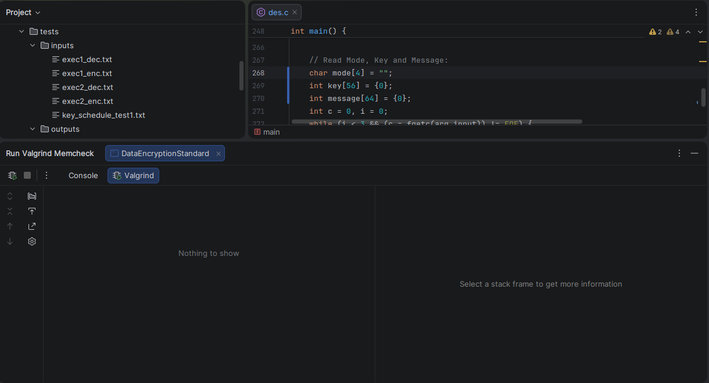

# Data Encryption Standard

## 📜 Overview:
This project aims to provide an implementation of the DES algorithm in the C programming language.
The DES algorithm was developed by IBM in the late 1970s and for a long time was considered the gold standard of cryptography; however, it is currently considered insecure. It is based on symmetric cryptography, meaning that the algorithm uses the same key to encrypt and decrypt a message. Furthermore, the algorithm operates on fixed-size blocks (64 bits).

## 💡 Basic Operation:
DES is a block cipher that operates under the Feistel Network scheme. It does not encrypt the text bit by bit (like stream ciphers), but rather in fixed chunks.
1. Block Size: 64 bits.
2. Key Size: 64 nominal bits, but only 56 bits are effectively used (8 bits are used for parity/verification).
3. Process: The algorithm subjects the data block to 16 rounds of identical transformations.

## 🤔 How To Use:
The execution flow is described below:
1. When executing the main function, the program will ask the user for the path to the input file and the path to the output file.
```
Enter the path to the input file: ../tests/inputs/exec1_enc.txt
Enter the path to the output file: ../tests/outputs/exec1_enc.txt
```
2. Both the input and output files must follow a specific format (Use "enc" for encryption and "dec" for decryption).
```
[enc/dec]
[key = 56 bits]
[message = 64 bits]
```
3. After following these steps, the code will generate the corresponding output.

## 🎯 Tests:
All the encrypted messages were successfully deciphered without altering the original text.

## 🧐 Valgrind:
Valgrind did not detect any errors.



## 🔏 Security:
DES (Data Encryption Standard) is no longer secure, primarily due to advances in computing power, which have rendered its key size obsolete.

